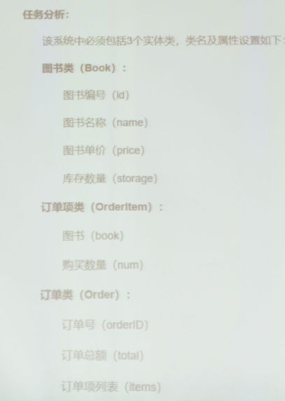

# 实训1

## 安装依赖（如果不打算启用MongoDB，就不用管这个）

1. 安装mongodb数据库
2. pip install pymongo

## 使用方法

1. 进入项目
2. python3 main.py
   1. 这期间可能会因为没有数据文件而报错，但是他会自动创建数据文件，重新运行两下程序就好了
3. 按照提示使用功能

## 要求

1. 输出所有图书的信息:包括每本书的编号、书名、单价、库存
2. 顾客购买书:根据提示输入图书编号来购买书,并根据提示输入购买书的的数量
3. 购买完毕后输出顾客的订单信息:包括订单号、订单明细、订单总额

## 数据持久化设计()

1. 保存到mongodb数据库
2. 保存到json文件
   1. 数据格式[{}]
      [{'id': 1, 'name': 'xxx'}, {'id': 2, 'name': 'yyy'}]

## 类设计

